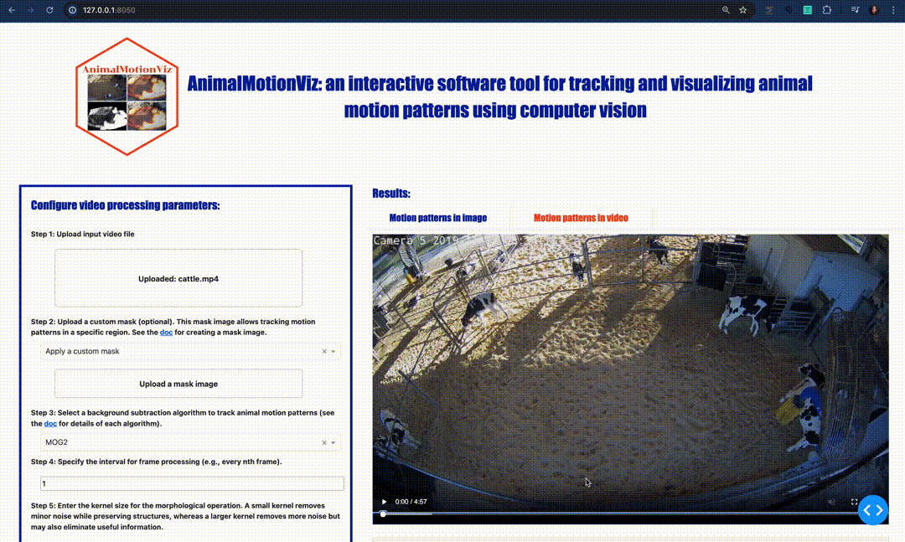

<h1 align="center">AnimalMotionViz</h1>

<p align="center">
An interactive software tool for tracking and visualizing animal motion patterns using computer vision
</p>

<!-- TABLE OF CONTENTS -->
<details open>
<summary>Table of Contents</summary>

- [Introduction](#introduction)
- [Section 1: Video demo for using AnimalMotionViz software](#section-1)
  - [1.1: AnimalMotionViz demo video](#section-1-1)
- [Section 2: Set up the environment for running AnimalMotionViz locally](#section-2)
  - [2.1: Install conda in your local computer](#section-2-1)
  - [2.2: Clone the AnimalMotionViz GitHub repository](#section-2-2)
  - [2.3: Install all dependencies for using AnimalMotionViz](#section-2-3)
  - [2.4: Activate the created conda environment "animalmotionviz" from the above step](#section-2-4)
  - [2.5: Run "AnimalMotionViz"](#section-2-5)
- [Section 3 (optional): Creating a custom mask for tracking motion patterns in a specific region](#section-3)
  - [3.1: Creating a Mask using LabelMe](#section-3-1)
    - [3.1.1:  Create a conda environment with Python installed](#section-3-1-1)
    - [3.1.2:  Installing LabelMe using the command line](#section-3-1-2)
    - [3.1.3:  Check the installed LabelMe version](#section-3-1-3)
    - [3.1.4:  Open the LabelMe GUI](#section-3-1-4)
    - [3.1.5:  Creating a mask for the region of interest using LabelMe](#section-3-1-5)
    - [3.1.6:  Converting the .JSON files to obtain the mask image](#section-3-1-6)
- [Section 4: How AnimalMotionViz works and its application](#section-4)
  - [4.1: How AnimalMotionViz Works](#section-4-1)
  - [4.2: Guidelines on setting up the video processing parameters](#section-4-2)
    - [4.2.1:  Uploading the input video](#section-4-2-1)
    - [4.2.2:  Uploading the mask image if available](#section-4-2-2)
    - [4.2.3:  Select a background subtraction algorithm](#section-4-2-3)
    - [4.2.4:  Specify the interval for frame processing (e.g., every nth frame)](#section-4-2-4)
    - [4.2.5:  Select a kernel size for the morphological operation](#section-4-2-5)
    - [4.2.6:  Choose the overlay parameters](#section-4-2-6)
    - [4.2.7:  Select a colormap](#section-4-2-7)
    - [4.2.8:  Start the video processing](#section-4-2-8)
- [Section 5: Results](#section-5)
  - [5.1: Motion heatmap image and video](#section-5-1)
  - [5.2: Motion metrics](#section-5-2)
- [Contact information and help](#section-contact)
- [References](#section-reference)
- [License](#section-license)
</details>

<!-- Introduction -->
## Introduction<a name="introduction"></a>

To provide novel insight into the movement and space use of dairy cattle, we developed `AnimalMotionViz`, an open-source software tool that processes video data to monitor animal movement patterns using computer vision. The software generates a motion heatmap image and video, along with motion metrics that highlight and quantify movement intensity and patterns. This software tool aims to support the broader adoption of computer vision systems, thereby further enabling precision livestock farming. 

## Section 1: Video demo for using AnimalMotionViz software <a name="section-1"></a>

We provide a video demo below to showcase the usage of our `AnimalMotionViz` software.

### 1.1 AnimalMotionViz demo video [[Video demo](https://www.youtube.com/watch?v=tzios7Q-ymU)]<a name="section-1-1"></a>


## Section 2: Set up the environment for running AnimalMotionViz locally <a name="section-2"></a>

### 2.1 Install [Conda](https://conda.io/projects/conda/en/latest/user-guide/install/index.html) on your local computer<a name="section-2-1"></a>

### 2.2 Clone the AnimalMotionViz GitHub repository <a name="section-2-2"></a>

```bash
# cloning "AnimalMotionViz/" folder from GitHub
git clone https://github.com/uf-aiaos/AnimalMotionViz.git

# change to the cloned/downloaded folder 
cd AnimalMotionViz/
```
### 2.3 Install all dependencies for using AnimalMotionViz<a name="section-2-3"></a>
```bash
# "environment.yml" is available under "AnimalMotionViz/"
conda env create -f environment.yml
```
### 2.4 Activate the created conda environment "animalmotionviz" from the above step<a name="section-2-4"></a>
```bash
conda activate animalmotionviz
```

### 2.5 Run "AnimalMotionViz"<a name="section-2-5"></a>
```bash
# change to the source code directory 
cd AnimalMotionViz_sourcecode/

# run the app 
python app.py
```
After that, open the follow link http://127.0.0.1:8050/ in your web brower and now you can use AnimalMotionViz locally!

## Section 3 (optional): Creating a custom mask for tracking motion patterns in a specific region <a name="section-3"></a>

### 3.1 Creating a Mask using `LabelMe` <a name="section-3-1"></a>

For users interested in tracking animal motion patterns within a specific region, a mask image can be uploaded that is created using annotation tools, allowing a region of interest to be specified in the image. While this step is optional, it is recommended as it enables the definition of specific areas to be considered during video processing, thereby increasing the focus and relevance of the analysis. Below, we have provided a tutorial on creating a mask image using the open-source graphical annotation tool [LabelMe](https://github.com/labelmeai/labelme). 

#### 3.1.1 Create a [conda environment](https://conda.io/projects/conda/en/latest/user-guide/install/index.html) with Python installed <a name="section-3-1-1"></a>
```bash
# create a conda env named `labelme`
conda create --name labelme

# activate the created `labelme`
conda activate labelme
```

#### 3.1.2 Installing `LabelMe` using the command line<a name="section-3-1-2"></a>
```bash
#installing LabelMe
pip install labelme
```

####  3.1.3 Check the installed `LabelMe` version <a name="section-3-1-3"></a>
```bash
labelme --version
```

####  3.1.4 Open the `LabelMe` GUI<a name="section-3-1-4"></a>
```bash
# opening the app
labelme 
```


#### 3.1.5 Creating a mask for the region of interest using `LabelMe` <a name="section-3-1-5"></a>

Get a frame from your video, and use it for creating a mask. Make sure the frame size is the same as your video's resolution. If you're using VLC/Quicktime Player, there's a function there that captures a frame from the video.


#### 3.1.6 Converting the `.JSON` files to obtain the mask image<a name="section-3-1-6"></a>

```bash
# go to directory where you save the .json file
cd Pictures\New Folder

#convert the .json files
labelme_json_to_dataset annotation.json -o annotation_json
```


##### **Note that only the mask image, `label.png`, will need to be uploaded in step 4.2.2 to specify a region of interest.**

## Section 4: How AnimalMotionViz works and it usage <a name="section-4"></a>

After setting up the necessary dependencies, we are ready to use the `AnimalMotionViz` software. This section provides detailed instructions on how to run and operate the `AnimalMotionViz` app. The source code of `AnimalMotionViz` is available at AnimalMotionViz_sourcecode [AnimalMotionViz_sourcecode](https://github.com/uf-aiaos/AnimalMotionViz/blob/main/AnimalMotionViz_sourcecode/).

### 4.1 How AnimalMotionViz Works <a name="section-4-1"></a>

`AnimalMotionViz` facilitates the uploading of video files via the [dash-uploader](https://github.com/fohrloop/dash-uploader) component, with an option to include an optional mask defining the Region of Interest (ROI). The software offers various background subtraction algorithms like [MOG2](https://docs.opencv.org/3.4/d7/d7b/classcv_1_1BackgroundSubtractorMOG2.html), [KNN](https://docs.opencv.org/3.4/db/d88/classcv_1_1BackgroundSubtractorKNN.html), [GMG](https://docs.opencv.org/4.x/d1/d5c/classcv_1_1bgsegm_1_1BackgroundSubtractorGMG.html), [CNT](https://docs.opencv.org/4.x/de/dca/classcv_1_1bgsegm_1_1BackgroundSubtractorCNT.html), [GSOC](https://docs.opencv.org/4.x/d4/dd5/classcv_1_1bgsegm_1_1BackgroundSubtractorGSOC.html), and [LSBP](https://docs.opencv.org/4.x/de/d4c/classcv_1_1bgsegm_1_1BackgroundSubtractorLSBP.html), implemented using OpenCV. Then users can specify the interval for frame processing (e.g., every nth frame). Users can also select a [kernel size](https://docs.opencv.org/4.x/d4/d86/group__imgproc__filter.html#gac342a1bb6eabf6f55c803b09268e36dc:~:text=Mat%20cv%3A%3AgetStructuringElement) for the [morphological operation](https://docs.opencv.org/4.x/d4/d86/group__imgproc__filter.html#ga67493776e3ad1a3df63883829375201f:~:text=%E2%97%86-,morphologyEx(),-void%20cv%3A%3AmorphologyEx), where it can mitigate small noises (birds, leaves, et.), as well as the weight [(alpha and beta)](https://docs.opencv.org/3.4/d2/de8/group__core__array.html#gafafb2513349db3bcff51f54ee5592a19:~:text=%E2%97%86-,addWeighted(),-void%20cv%3A%3AaddWeighted) of the original frame and motion heatmap overlay, respectively. Several [colormaps](https://docs.opencv.org/4.x/d3/d50/group__imgproc__colormap.html#:~:text=ColormapTypes-,Enumerations,-enum%20%C2%A0) like `Bone`, `Ocean`, `Pink`, and `Hot` are available for enhancing the visualization of the motion heatmap. The motion heatmap is generated by applying a colormap to the accumulated image obtained from background subtraction and filtering, which is then overlaid on the original frame.

### 4.2 Guidelines on setting up the video processing parameters <a name="section-4-2"></a>

This section provides clear and concise guidelines for configuring parameters in `AnimalMotionViz`, including uploading video and mask files, selecting background subtraction algorithms, adjusting overlay settings, and applying colormaps. By following these instructions, users can fully utilize AnimalMotionViz to track and visualize animal movement patterns.

#### 4.2.1 Uploading the input video <a name="section-4-2-1"></a>

Upload the video file for tracking animal motion patterns. The software supports various video formats, including `mp4`, `avi`, `mov`, `wmv`, etc. We have also provided an example [video](https://github.com/uf-aiaos/AnimalMotionViz/blob/main/AnimalMotionViz_sourcecode/demofiles/cattle.mp4) to demonstrate the usage of the software.

#### 4.2.2 Uploading the mask image if available<a name="section-4-2-2"></a>

You may upload a mask (e.g., label.png file created above using LabelMe) to define the region or area of interest, which can be applied during video processing. 

#### 4.2.3 Select a background subtraction algorithm <a name="section-4-2-3"></a>

Choose from a selection of background subtraction algorithms, including [MOG2](https://docs.opencv.org/3.4/d7/d7b/classcv_1_1BackgroundSubtractorMOG2.html), [KNN](https://docs.opencv.org/3.4/db/d88/classcv_1_1BackgroundSubtractorKNN.html), [GMG](https://docs.opencv.org/4.x/d1/d5c/classcv_1_1bgsegm_1_1BackgroundSubtractorGMG.html), [CNT](https://docs.opencv.org/4.x/de/dca/classcv_1_1bgsegm_1_1BackgroundSubtractorCNT.html), [GSOC](https://docs.opencv.org/4.x/d4/dd5/classcv_1_1bgsegm_1_1BackgroundSubtractorGSOC.html), and [LSBP](https://docs.opencv.org/4.x/de/d4c/classcv_1_1bgsegm_1_1BackgroundSubtractorLSBP.html), implemented using OpenCV.

#### 4.2.4:  Specify the interval for frame processing (e.g., every nth frame) <a name="section-4-2-4"></a>

In this step, the frame processing interval allows users to select a subset of frames from the video for analysis by choosing to process every nth frame (e.g., every 5th frame), which reduces computational load. This approach is particularly useful for long videos or when changes between consecutive frames are trivial, allowing users to capture key movements efficiently.

#### 4.2.5:  Select a kernel size for the morphological operation <a name="section-4-2-5"></a>

Here, users can specify the [kernel size](https://docs.opencv.org/4.x/d4/d86/group__imgproc__filter.html#gac342a1bb6eabf6f55c803b09268e36dc:~:text=Mat%20cv%3A%3AgetStructuringElement) for the [morphological operation](https://docs.opencv.org/4.x/d4/d86/group__imgproc__filter.html#ga67493776e3ad1a3df63883829375201f:~:text=%E2%97%86-,morphologyEx(),-void%20cv%3A%3AmorphologyEx). A smaller kernel focuses on removing minor noise while maintaining the integrity of key structures in the image. On the other hand, a larger kernel is more effective at eliminating substantial noise but may also risk removing important details or features, depending on the complexity of the image.

#### 4.2.6 Choose the overlay parameters <a name="section-4-2-6"></a>

Customize the weight [(alpha and beta)](https://docs.opencv.org/3.4/d2/de8/group__core__array.html#gafafb2513349db3bcff51f54ee5592a19:~:text=%E2%97%86-,addWeighted(),-void%20cv%3A%3AaddWeighted) of the original frame and the motion heatmap overlay to achieve the desired visual effect. `Alpha` is the weight of the first array elements (frame image), while `Beta` is the weight of the second array elements (overlay).

#### 4.2.7 Select a colormap <a name="section-4-2-7"></a>

Select from various [colormaps](https://docs.opencv.org/4.x/d3/d50/group__imgproc__colormap.html#:~:text=ColormapTypes-,Enumerations,-enum%20%C2%A0) such as Bone, Ocean, Pink, and Hot to enhance the visualization of the returned motion heatmap.

#### 4.2.8 Start the video processing<a name="section-4-2-8"></a>

Run the video analysis to track and visualize animal motion patterns based on the provided parameters.

## Section 5: Results <a name="section-5"></a>

### 5.1 Motion heatmap image and video <a name="section-5-1"></a>




### 5.2 Motion metrics <a name="section-5-2"></a>

- **Peak Intensity Location:** This metric refers to the specific location within the region where the most movement is detected. The table shows three peak intensity locations, each with an X and Y coordinate.

- **Overall Percentage of Used Region:** This metric represents the portion of the entire region that’s being used for movement. 

- **Quadrant X Percentage of Used Region:** This metric breaks down how much space is being used for movement in each quadrant of the region. There are four quadrants, labelled 1 to 4. For each quadrant, the metric shows the percentage of the quadrant’s space that is being used.


<!-- contact and help -->
## Contact information and help <a name="section-contact"></a>

- Angelo De Castro ([decastro.a@ufl.edu](mailto:decastro.a@ufl.edu))
- Haipeng Yu ([haipengyu@ufl.edu](mailto:haipengyu@ufl.edu))

<!-- References -->
## References <a name="section-reference"></a>
If you use the materials provided in this repository, we kindly ask you to cite our papers: 

- The software paper: De Castro, A. L., Wang, J., Bonnie-King, J. G., Morota, G., Miller-Cushon, E. K., & Yu, H. (2024). AnimalMotionViz: An interactive software tool for tracking and visualizing animal motion patterns using computer vision. *bioRxiv*. https://doi.org/10.1101/2024.10.22.619671
 
- The application paper: Marin, M.U., Gingerich, K.N., Wang, J., Yu, H. and Miller-Cushon, E.K., 2024. Effects of space allowance on patterns of activity in group-housed dairy calves. *JDS Communications*.


<!-- License -->
## License <a name="section-license"></a>
This project is primarily licensed under the GNU General Public License version 3 (GPLv3). 
