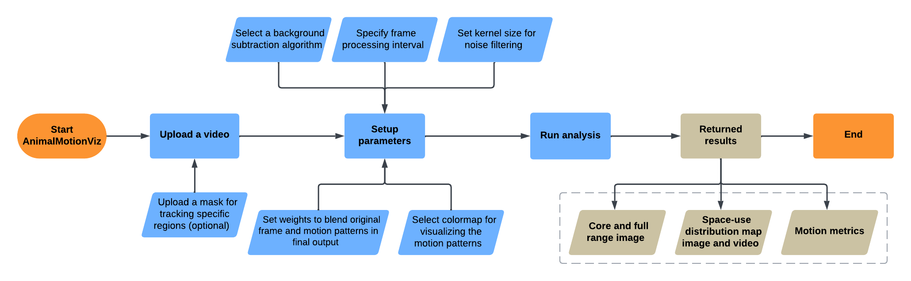

<h1 align="center">AnimalMotionViz</h1>

<p align="center">
An interactive software tool for tracking and visualizing animal motion patterns using computer vision
</p>

<!-- TABLE OF CONTENTS -->
<details open>
<summary>Table of Contents</summary>

- [Introduction](#introduction)
- [Section 1: Video demonstration of AnimalMotionViz](#section-1)
  - [1.1: AnimalMotionViz online demonstration video](#section-1-1)
- [Section 2: Setting up the environment for running AnimalMotionViz locally](#section-2)
  - [2.1: Installing Conda in your local computer](#section-2-1)
  - [2.2: Cloning the AnimalMotionViz GitHub repository](#section-2-2)
  - [2.3: Installing all dependencies for using AnimalMotionViz](#section-2-3)
  - [2.4: Activating the created Conda environment "animalmotionviz"](#section-2-4)
  - [2.5: Running "AnimalMotionViz"](#section-2-5)
- [Section 3 (optional): Creating a custom mask for tracking motion patterns in a specific region](#section-3)
  - [3.1: Creating a mask using LabelMe](#section-3-1)
    - [3.1.1:  Creating a Conda environment with Python installed](#section-3-1-1)
    - [3.1.2:  Installing LabelMe](#section-3-1-2)
    - [3.1.3:  Checking the installed LabelMe version](#section-3-1-3)
    - [3.1.4:  Opening the LabelMe GUI](#section-3-1-4)
    - [3.1.5:  Creating a mask for the region of interest using LabelMe](#section-3-1-5)
    - [3.1.6:  Converting the .JSON files to obtain the mask image](#section-3-1-6)
- [Section 4: How AnimalMotionViz works and its application](#section-4)
  - [4.1: Overview of AnimalMotionViz](#section-4-1)
  - [4.2: Guidelines on setting up the video processing parameters](#section-4-2)
    - [4.2.1:  Uploading the input video](#section-4-2-1)
    - [4.2.2:  Uploading the mask image if available](#section-4-2-2)
    - [4.2.3:  Selecting a background subtraction algorithm](#section-4-2-3)
    - [4.2.4:  Specifying the frame processing interval](#section-4-2-4)
    - [4.2.5:  Selecting a kernel size for morphological operation](#section-4-2-5)
    - [4.2.6:  Selecting a threshold value for filtering detected motions](#section-4-2-6)
    - [4.2.7:  Choosing the overlay parameters](#section-4-2-7)
    - [4.2.8:  Selecting a colormap](#section-4-2-8)
    - [4.2.9:  Starting the video processing](#section-4-2-9)
- [Section 5: Results](#section-5)
  - [5.1: Space-use distribution map image and video, and core and full range image](#section-5-1)
  - [5.2: Motion metrics](#section-5-2)
- [Contact information and help](#section-contact)
- [References](#section-reference)
- [License](#section-license)
</details>

<!-- Introduction -->
## Introduction<a name="introduction"></a>

To provide novel insights into the movement and space use of dairy cattle, we developed `AnimalMotionViz`, an open-source software tool that processes video data to monitor animal movement patterns using computer vision. The software generates a space-use distribution map image, a space-use distribution map video, a core and full-range image, and motion metrics, including the total and within-quadrant percentages of area used, as well as the top three peak intensity locations. This software tool aims to support the broader adoption of computer vision systems, thereby further enabling precision livestock farming. 

## Section 1: Video demonstration of AnimalMotionViz <a name="section-1"></a>

We provided an online video to demonstrate how to use our AnimalMotionViz software.

### 1.1 AnimalMotionViz online demonstration video [[Video demo](https://youtu.be/ar-coaOhjsk)]<a name="section-1-1"></a>


## Section 2: Setting up the environment for running AnimalMotionViz locally <a name="section-2"></a>

### 2.1 Installing [Conda](https://conda.io/projects/conda/en/latest/user-guide/install/index.html) on your local computer<a name="section-2-1"></a>

### 2.2 Cloning the AnimalMotionViz GitHub repository <a name="section-2-2"></a>

```bash
# cloning "AnimalMotionViz/" folder from GitHub
git clone https://github.com/uf-aiaos/AnimalMotionViz.git

# change to the cloned/downloaded folder 
cd AnimalMotionViz/
```
### 2.3 Installing all dependencies for using AnimalMotionViz<a name="section-2-3"></a>
```bash
# "environment.yml" is available under "AnimalMotionViz/"
conda env create -f environment.yml
```
### 2.4 Activating the created Conda environment "animalmotionviz"<a name="section-2-4"></a>
```bash
conda activate animalmotionviz
```

### 2.5 Running "AnimalMotionViz"<a name="section-2-5"></a>
```bash
# change to the source code directory 
cd AnimalMotionViz_sourcecode/

# run the app 
python app.py
```
After that, open the following link http://127.0.0.1:8050/ in your web browser, and you can now use AnimalMotionViz locally!

## Section 3 (optional): Creating a custom mask for tracking motion patterns in a specific region <a name="section-3"></a>

### 3.1 Creating a mask using `LabelMe` <a name="section-3-1"></a>

For users interested in tracking animal motion patterns within a specific region, a mask image created using annotation tools can be uploaded to specify a region of interest in the image. While this step is optional, it is recommended as it helps define specific areas to be considered during video processing, increasing the focus and relevance of the analysis. Below, we have provided a tutorial on creating a mask image using the open-source graphical annotation tool [LabelMe](https://github.com/labelmeai/labelme). 

#### 3.1.1 Creating a [Conda environment](https://conda.io/projects/conda/en/latest/user-guide/install/index.html) with Python installed <a name="section-3-1-1"></a>
```bash
# create a conda env named `labelme`
conda create --name labelme

# activate the created `labelme`
conda activate labelme
```

#### 3.1.2 Installing `LabelMe`<a name="section-3-1-2"></a>
```bash
#installing LabelMe
pip install labelme
```

####  3.1.3 Checking the installed `LabelMe` version <a name="section-3-1-3"></a>
```bash
labelme --version
```

####  3.1.4 Opening the `LabelMe` GUI<a name="section-3-1-4"></a>
```bash
# opening the app
labelme 
```


#### 3.1.5 Creating a mask for the region of interest using `LabelMe` <a name="section-3-1-5"></a>

Extract a frame from your video and use it to create a mask. Make sure the frame size matches your video’s resolution. If you are using VLC or QuickTime Player,  you can use a built-in function to capture a frame from the video.


#### 3.1.6 Converting the `.JSON` files to obtain the mask image<a name="section-3-1-6"></a>

```bash
# go to directory where you save the .json file
cd Pictures\New Folder

#convert the .json files
labelme_json_to_dataset annotation.json -o annotation_json
```


##### **Note that only the mask image, `label.png`, will need to be uploaded in step 4.2.2 to specify a region of interest.**

## Section 4: How AnimalMotionViz works and its application <a name="section-4"></a>

After setting up the necessary dependencies, we are ready to use the `AnimalMotionViz` software. This section provides detailed instructions on how to run and operate the `AnimalMotionViz` app. The source code of `AnimalMotionViz` is available at AnimalMotionViz_sourcecode [AnimalMotionViz_sourcecode](https://github.com/uf-aiaos/AnimalMotionViz/blob/main/AnimalMotionViz_sourcecode/).

### 4.1 Overview of AnimalMotionViz <a name="section-4-1"></a>

`AnimalMotionViz` facilitates the uploading of video files via the [dash-uploader](https://github.com/fohrloop/dash-uploader) component, with an option to include an optional mask defining the Region of Interest (ROI). The software offers various background subtraction algorithms like [MOG2](https://docs.opencv.org/3.4/d7/d7b/classcv_1_1BackgroundSubtractorMOG2.html), [KNN](https://docs.opencv.org/3.4/db/d88/classcv_1_1BackgroundSubtractorKNN.html), [GMG](https://docs.opencv.org/4.x/d1/d5c/classcv_1_1bgsegm_1_1BackgroundSubtractorGMG.html), [CNT](https://docs.opencv.org/4.x/de/dca/classcv_1_1bgsegm_1_1BackgroundSubtractorCNT.html), [GSOC](https://docs.opencv.org/4.x/d4/dd5/classcv_1_1bgsegm_1_1BackgroundSubtractorGSOC.html), and [LSBP](https://docs.opencv.org/4.x/de/d4c/classcv_1_1bgsegm_1_1BackgroundSubtractorLSBP.html), implemented using OpenCV. Then users can specify the interval for frame processing (e.g., every nth frame). Users can also select a [kernel size](https://docs.opencv.org/4.x/d4/d86/group__imgproc__filter.html#gac342a1bb6eabf6f55c803b09268e36dc:~:text=Mat%20cv%3A%3AgetStructuringElement) for the [morphological operation](https://docs.opencv.org/4.x/d4/d86/group__imgproc__filter.html#ga67493776e3ad1a3df63883829375201f:~:text=%E2%97%86-,morphologyEx(),-void%20cv%3A%3AmorphologyEx), which can mitigate small noise (birds, leaves, etc.), as well as the weight [(alpha and beta)](https://docs.opencv.org/3.4/d2/de8/group__core__array.html#gafafb2513349db3bcff51f54ee5592a19:~:text=%E2%97%86-,addWeighted(),-void%20cv%3A%3AaddWeighted) of the original frame and motion map overlay, respectively. Additionally, core and full range analysis is computed by applying [Kernel Density Estimation (KDE)](https://docs.scipy.org/doc/scipy/reference/generated/scipy.stats.gaussian_kde.html) to the centroids of detected [contours](https://docs.opencv.org/4.x/d3/dc0/group__imgproc__shape.html#ga2c759ed9f497d4a618048a2f56dc97f1:~:text=%E2%97%86-,contourArea(),-double%20cv%3A%3AcontourArea) representing motion. The core range identifies areas with the highest motion density (50% isopleth), while the full range captures almost all detected motion (95% isopleth). Convex hulls are also computed to outline the external boundaries of detected motion regions, providing a comprehensive view of the movements. Several [colormaps](https://docs.opencv.org/4.x/d3/d50/group__imgproc__colormap.html#:~:text=ColormapTypes-,Enumerations,-enum%20%C2%A0) like `Bone`, `Ocean`, `Pink`, and `Hot` are available for enhancing the visualization of the motion map. The space-use distribution map is generated by applying a colormap to the accumulated image obtained from background subtraction and filtering, which is then overlaid on the original frame.

 
Overall workflow of AnimalMotionViz: The start and end points are highlighted by bright orange shapes, the user inputs are shown in blue shapes, and the returned results are represented by beige shapes.

### 4.2 Guidelines on setting up the video processing parameters <a name="section-4-2"></a>

This section provides clear and concise guidelines for configuring parameters in `AnimalMotionViz`, including uploading video and mask files, selecting background subtraction algorithms, adjusting overlay settings, and applying colormaps. By following these instructions, users can fully utilize AnimalMotionViz to track and visualize animal movement patterns.

#### 4.2.1 Uploading the input video <a name="section-4-2-1"></a>

Upload the video file for tracking animal motion patterns. The software supports various video formats, including `mp4`, `avi`, `mov`, `wmv`, etc. We have also provided an example [video](https://github.com/uf-aiaos/AnimalMotionViz/blob/main/AnimalMotionViz_sourcecode/demofiles/cattle.mp4) to demonstrate the usage of the software.

#### 4.2.2 Uploading the mask image if available<a name="section-4-2-2"></a>

You may upload a mask (e.g., the label.png file created above using LabelMe) to define the region or area of interest, which can be applied during video processing. 

#### 4.2.3 Selecting a background subtraction algorithm <a name="section-4-2-3"></a>

Choose a background subtraction algorithm from [MOG2](https://docs.opencv.org/3.4/d7/d7b/classcv_1_1BackgroundSubtractorMOG2.html), [KNN](https://docs.opencv.org/3.4/db/d88/classcv_1_1BackgroundSubtractorKNN.html), [GMG](https://docs.opencv.org/4.x/d1/d5c/classcv_1_1bgsegm_1_1BackgroundSubtractorGMG.html), [CNT](https://docs.opencv.org/4.x/de/dca/classcv_1_1bgsegm_1_1BackgroundSubtractorCNT.html), [GSOC](https://docs.opencv.org/4.x/d4/dd5/classcv_1_1bgsegm_1_1BackgroundSubtractorGSOC.html), and [LSBP](https://docs.opencv.org/4.x/de/d4c/classcv_1_1bgsegm_1_1BackgroundSubtractorLSBP.html), implemented using OpenCV.

#### 4.2.4:  Specifying the frame processing interval <a name="section-4-2-4"></a>

In this step, the frame processing interval allows users to select a subset of frames from the video for analysis by choosing to process every nth frame (e.g., every 5th frame), which reduces computational load. This approach is particularly useful for long videos or when changes between consecutive frames are trivial, allowing users to capture key movements efficiently.

#### 4.2.5:  Selecting a kernel size for morphological operation <a name="section-4-2-5"></a>

Here, users can specify the [kernel size](https://docs.opencv.org/4.x/d4/d86/group__imgproc__filter.html#gac342a1bb6eabf6f55c803b09268e36dc:~:text=Mat%20cv%3A%3AgetStructuringElement) for the [morphological operation](https://docs.opencv.org/4.x/d4/d86/group__imgproc__filter.html#ga67493776e3ad1a3df63883829375201f:~:text=%E2%97%86-,morphologyEx(),-void%20cv%3A%3AmorphologyEx). A smaller kernel focuses on removing minor noise while maintaining the integrity of key structures in the image. On the other hand, a larger kernel is more effective at eliminating substantial noise but may also risk removing important details or features, depending on the complexity of the image.

#### 4.2.6 Selecting a threshold value for filtering detected motions <a name="section-4-2-6"></a>

A [threshold value](https://docs.opencv.org/4.x/d3/dc0/group__imgproc__shape.html#ga2c759ed9f497d4a618048a2f56dc97f1:~:text=%E2%97%86-,contourArea(),-double%20cv%3A%3AcontourArea) can be set to filter the detected movements, focusing on more significant motions when calculating the core and full range. Increasing the threshold will exclude smaller movements and noise, allowing the analysis to focus on substantial motion patterns while reducing the effect of small noise.

#### 4.2.7 Choosing the overlay parameters <a name="section-4-2-7"></a>

Customize the weight [(alpha and beta)](https://docs.opencv.org/3.4/d2/de8/group__core__array.html#gafafb2513349db3bcff51f54ee5592a19:~:text=%E2%97%86-,addWeighted(),-void%20cv%3A%3AaddWeighted) of the original frame and the motion map overlay to achieve the desired visual effect. `Alpha` is the weight of the first array elements (frame image), while `Beta` is the weight of the second array elements (overlay).

#### 4.2.8 Selecting a colormap <a name="section-4-2-8"></a>

Select from various [colormaps](https://docs.opencv.org/4.x/d3/d50/group__imgproc__colormap.html#:~:text=ColormapTypes-,Enumerations,-enum%20%C2%A0) such as Bone, Ocean, Pink, and Hot to enhance the visualization of the returned motion space-use distribution map.

#### 4.2.9 Starting the video processing<a name="section-4-2-9"></a>

Run the video analysis to track and visualize animal motion patterns based on the provided parameters.

## Section 5: Results <a name="section-5"></a>

### 5.1 Space-use distribution map image and video, and core and full range image <a name="section-5-1"></a>


### 5.2 Motion metrics <a name="section-5-2"></a>

- **Peak Intensity Location:** This metric refers to the specific location within the region where the most movement is detected. The table shows three peak intensity locations, each with an X and Y coordinate.

- **Overall Percentage of Used Region:** This metric represents the portion of the entire region that’s being used for movement. 

- **Quadrant X Percentage of Used Region:** This metric breaks down how much space is being used for movement in each quadrant of the region. There are four quadrants, labelled 1 to 4. For each quadrant, the metric shows the percentage of the quadrant’s space that is being used.

- **Core Range:** This metric measures the area of the 50% isopleth in pixels, representing the most frequently used space within the frame.
  
- **Full Range:** This metric measures the area of the 95% isopleth in pixels, capturing the majority of the detected movement within the frame.


<!-- contact and help -->
## Contact information and help <a name="section-contact"></a>

- Angelo De Castro ([decastro.a@ufl.edu](mailto:decastro.a@ufl.edu))
- Haipeng Yu ([haipengyu@ufl.edu](mailto:haipengyu@ufl.edu))

<!-- References -->
## References <a name="section-reference"></a>
If you use the materials provided in this repository, we kindly ask you to cite our papers: 

- The software paper: De Castro, A.L., Wang, J., Bonnie-King, J.G., Morota, G., Miller-Cushon, E.K., and Yu, H., 2025. AnimalMotionViz: An interactive software tool for tracking and visualizing animal motion patterns using computer vision. *JDS Communication*. In press. https://doi.org/10.1101/2024.10.22.619671
 
- The application paper: Marin, M.U., Gingerich, K.N., Wang, J., Yu, H. and Miller-Cushon, E.K., 2024. Effects of space allowance on patterns of activity in group-housed dairy calves. *JDS Communications*.


<!-- License -->
## License <a name="section-license"></a>
This project is primarily licensed under the GNU General Public License version 3 (GPLv3). 
